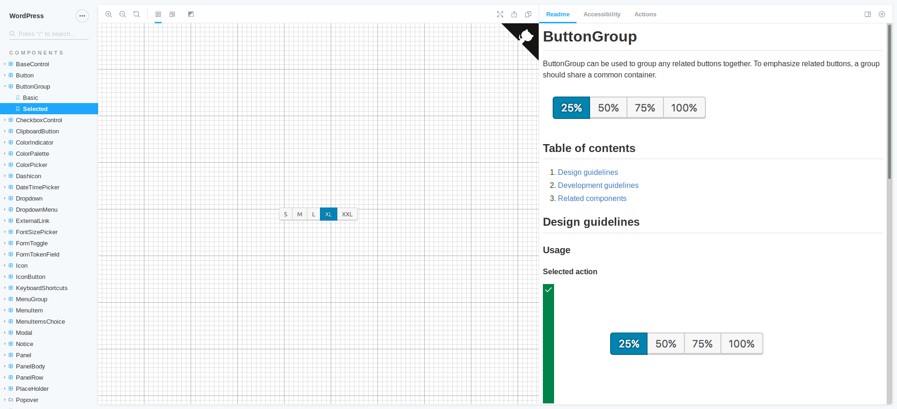

 

## Introduction

Explore various WordPress react components to speed up your development. 

## Usage

- Visit https://wp-storybook.netlify.com/
- Explore and test various WordPress components
- Search and view different states/variate of components
- Test on different viewports
- Readme and live preview of component in one place

## Development

- Clone repo `git clone git@github.com:lubusIN/wp-storybook.git`
- Install all dependencies `npm install`
- Run & watch storybook `npm run storybook`
- Generate static storybook `npm run build-storybook` 

## Changelog

Please see the [Changelog](CHANGELOG.md) 

## Feedback / Suggestions

If you have any suggestions/feature request that you would like to see in the upcoming releases, feel free to let us know in the [issues section](https://github.com/lubusIN/wp-storybook/issues)

## Contributing

Thank you in advance if you wish to contribute to the `WP Storybook`. You can read the contribution guidelines [here](CONTRIBUTING.md)

Check the development tasklist [here](https://github.com/lubusIN/wp-storybook/projects/1), if something interests you or want to suggest something click [here](https://github.com/lubusIN/wp-storybook/issues)

## Security

If you discover any security related issues, please email to [ajit@lubus.in](mailto:ajit@lubus.com) instead of using the issue tracker.

## Credits

[Ajit Bohra](https://twitter.com/ajitbohra)

## Other Gutenberg Goodies
<table width="100%">
	<tr>
		<td width="33.33%">
			
		</td>
		<td width="33.33%">
			
		</td>
		<td width="33.33%">
			
		</td>
	</tr>
	<tr>
		<td width="33.33%">
			
		</td>
		<td width="33.33%">
			<strong><i>More coming soon ...</i>
		</td>
		<td width="33.33%">
			&nbsp;
		</td>
	</tr>
</table>

##  Support Us

[LUBUS](http://lubus.in) is a web design agency based in Mumbai, India.

You can pledge on [patreon](https://www.patreon.com/lubus) to support the development & maintenance of various [opensource](https://github.com/lubusIN/) stuff we are building.

## License

`WP Storybook` is an open-source software licensed under the [MIT](LICENSE)
